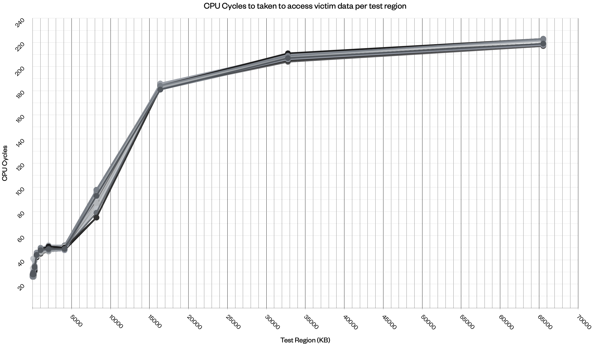
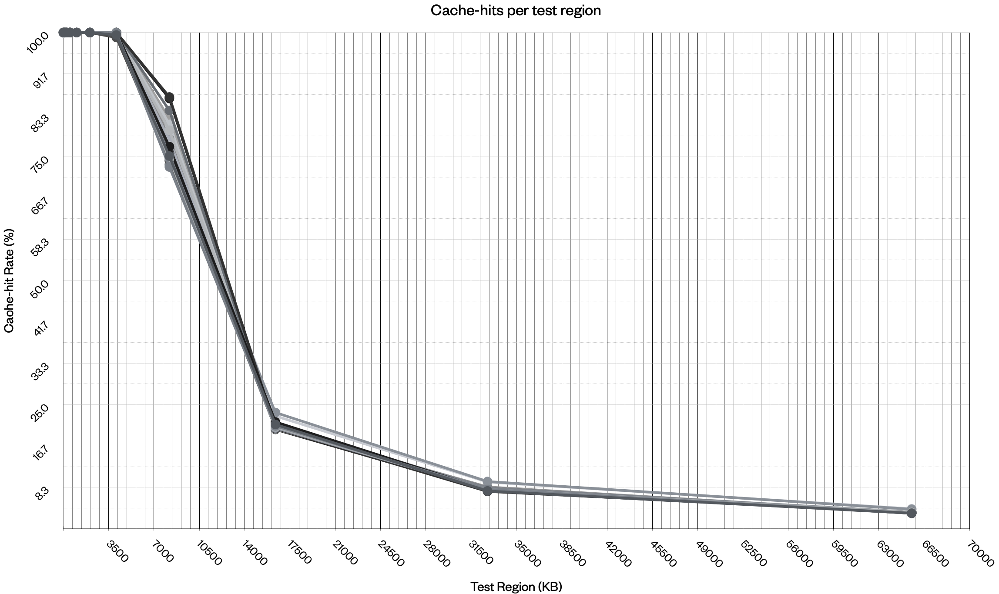

# Report
## Report

### Design
The test parameters can be configured in [src/config.h](src/config.h).

Other edits can be made by (un)commenting lines throughout the source code:
- Change the print output in [src/main.c](src/main.c) to use either `print_csv` or `print_results`
- Change the CPU instructions used in [src/probe.c](src/probe.c) to use either `_mm_clflush` or `_mm_clflushopt`
    - Here we could also remove `_mm_mfence`

## Results
CSV data can be found in [log/csv](log/csv) which also contains the data parsed by [log/parse.py](log/parse.py).
Otherwise, [log/data_best.numbers](log/data_best.numbers) has the tables and plots used for this report.

**The results of all tests indicate the total size of the LLC is 9MiB.**
This reflects the output of `lscpu` which you can find in [log/lscpu.txt](log/lscpu.txt).


## Cache-hits vs CPU Cycles for Test Regions
| Region KB    | 4     | 8     | 16    | 32    | 64    | 128   | 256   | 512   | 1024  | 2048  | 4096 | 8192 | 16384  | 32768  | 65536  |
|--------------|-------|-------|-------|-------|-------|-------|-------|-------|-------|-------|------|------|--------|--------|--------|
| Cache-hits % | 100.0 | 100.0 | 100.0 | 100.0 | 100.0 | 100.0 | 100.0 | 100.0 | 100.0 | 100.0 | 99.8 | 77.3 | 20.7   | 8.0    | 3.3    |
| CPU Cycles   | 26.5  | 26.8  | 26.7  | 27.3  | 27.0  | 27.5  | 33.8  | 43.9  | 47.6  | 48.4  | 49.7 | 94.2 | 183.1  | 207.1  | 219.7  |


_Note: this is the average taken over 100 runs of the `main` program._

The CPU cycles taken to access the victim's data can indicate when there's a cache-miss, i.e., when the data has been sent to main memory.



We can infer the size of each level by observing the rates computed at each test region:
- **L1** cache fits around 32 KB, with consistently ~26-27 cycles and a 100% cache-hit rate.
- **L2** cache fits around 256 KB, with consistently ~33 cycles and a 100% cache-hit rate.
- **L3** cache fits up to around 8192 KB, with consistently ~50 cycles and a 94% cache-hit rate.

The output of `lspcu` shows:
```
Caches (sum of all):      
  L1d:                    192 KiB (6 instances)
  L1i:                    192 KiB (6 instances)
  L2:                     1.5 MiB (6 instances)
  L3:                     9 MiB (1 instance)
```

Since there are 6 instances for each level (except for L3), we can multiply the estimated sizes by the amount of instances.
- `L1d = 32 * 6 = 192 KiB`
- `L1i = 32 * 6 = 192 KiB`
- `L2 = 256 * 6 = 1536 = 1.5 MiB`

For L3, we know that the actual size is 9 MiB (one instance), but the CPU cycles increase at 8192 KiB. However, there is also a sharp drop in cache-hit rate (-56.8%) at 16384 KiB.



This suggest that the actual size is slightly above the difference between 8192 Kib and 16384 KiB, i.e., something like 9 MiB.


## Unexpected Results
Fine-tuning the parameters in [src/config.h](src/config) and using hardware generated seeds for random access helped reduce the occurrence of odd results.

Prior to this, I noticed that around every 5th run I was getting cache-hits in the 16384 KiB region. This was due to the threshold calculation being way too high:

## LLC Discovery (507 threshold)
| Size (KB) | Cycles | Cache Hit |
| :-------- | -----: | --------: |
|      4 KB |     27 |   100.0 % |
|      8 KB |     27 |   100.0 % |
|     16 KB |     27 |   100.0 % |
|     32 KB |     27 |   100.0 % |
|     64 KB |     27 |   100.0 % |
|    128 KB |     27 |   100.0 % |
|    256 KB |     34 |   100.0 % |
|    512 KB |     43 |   100.0 % |
|   1024 KB |     47 |   100.0 % |
|   2048 KB |     48 |   100.0 % |
|   4096 KB |     48 |   100.0 % |
|   8192 KB |     87 |    99.5 % |
|  16384 KB |    182 |    99.0 % | **Unexpected cache hit.**
|  32768 KB |    207 |    98.9 % | **Unexpected cache hit.**
|  65536 KB |    218 |    98.8 % | **Unexpected cache hit.**

I wasted a bunch of time trying to figure out if there was a correlation between the time of test and cache-hits (see [log/run-unexpected-cache-hits.txt](log/run-unexpected-cache-hits.txt)).

In the end, I just increased `WARMUP` (used in the `main` loop in [src/main.c](src/main.c)) and `SAMPLE_SIZE` (which is used for `probe_cpu_threshold()` in [src/probe.c](src/probe.c)).
